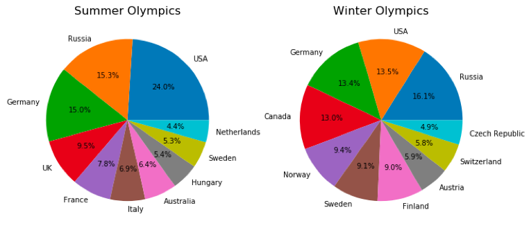
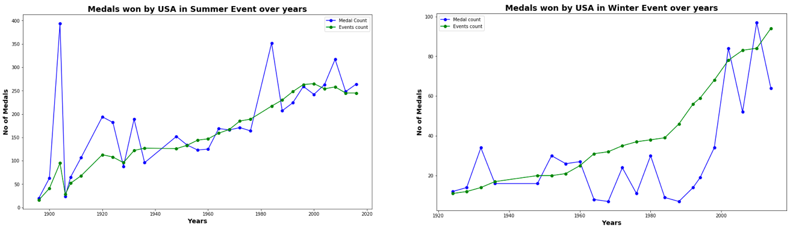
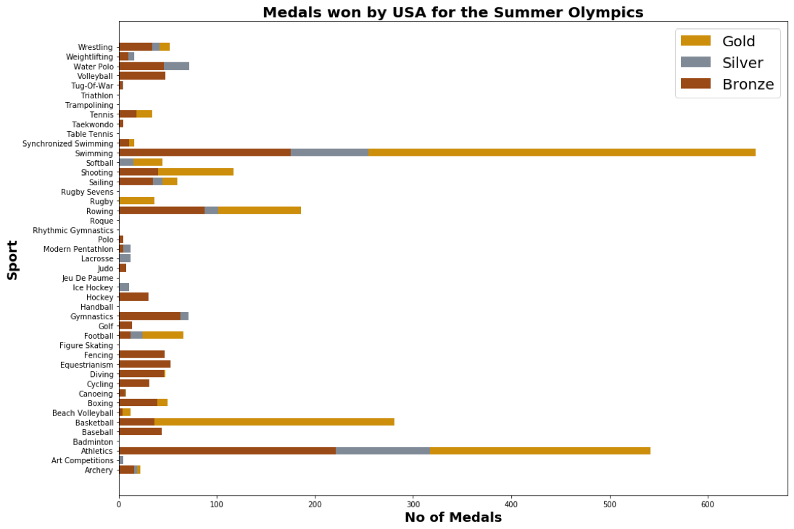
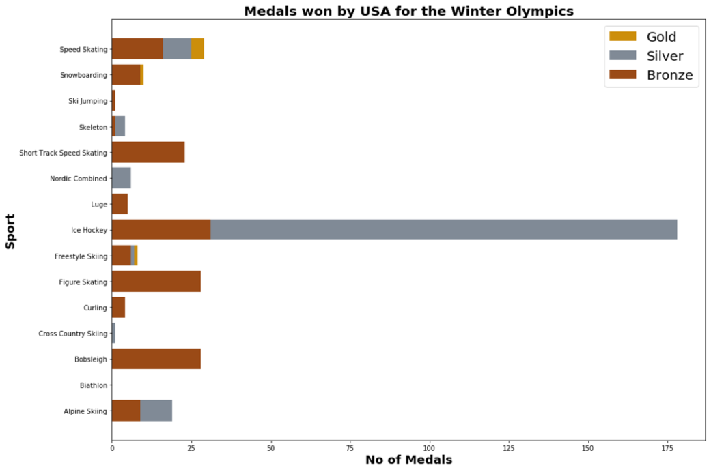
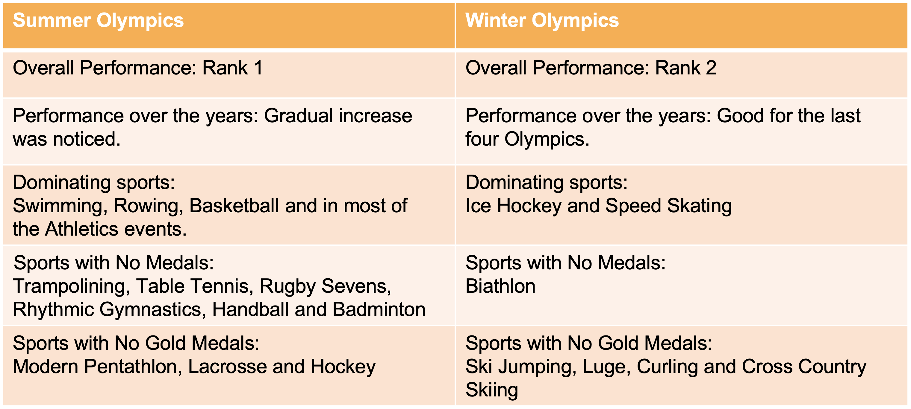

# USA in the Olympics - Basic Data Exploration and Preparation

## Introduction:
This project uses the dataset called 120 years of Olympic history from
Kaggle. The objective is to analyze the performance of USA in the Olympics over
the years. Methods like Data Cleaning and Data Preparation were used to get the
data ready for analyzing. Key findings were the standings of USA with respect to
the Medals won, sports dominated by USA in the Olympics and the type of sports
with no medals won.

## Dataset:
The Dataset used here is called 120 years of Olympic history.It contains historical dataset on
the modern Olympic Games, including all the Games from Athens 1896 to Rio 2016.
- Source: Kaggle
- Location: https://www.kaggle.com/heesoo37/120-years-of-olympic-history-athletes-and-results
- Content:
     - The file athlete_events.csv contains 271116 rows and 15 columns. Each row corresponds to an
individual athlete competing in an individual Olympic event (athlete-events). The columns are ID,
Name, Sex, Age , Height, Weight, Team, NOC, Games, Year, Season, City, Sport, Event and
Medal.
     - The file noc_regions.csv contains 230 rows and 3 columns. The columns are NOC (National
Olympic Committee 3 letter code),Country name and Notes.

## Data Preparation and Cleaning:

- By initial analysis, we found that Age, Height, Weight and Medals had lot of missing values. The
column ‘Medal’ had 231333 missing values. This is fine because not all the participants can win a
medal. So replaced these values with ‘No Medal’.
- To get the region of the Team in the athlete events.csv, there was merge done for athlete events and
region dataset based on their NOC values.
- Problems – Some NOC present in the athlete events dataset does not associate to a country from the
regions dataset. But we can easily add them manually based on their TEAM Name. This was
performed to reduce the number of missing values in the dataset.

## Research Question:

The aim here is to get the overall performance of USA in Olympics for Summer and Winter Seasons. Also understand, sports that were dominated by the USA over the years and that needs more attention by the country to improve their performance in the Olympics.

## Findings:

#### Summer Olympics:
   Among the Top 10 countries with the highest number of medals, we see that USA ranks No 1 with the most number of medals won. It has achieved 24% of medals among the Top 10.

#### Winter Olympics:
   Among the Top 10 countries, USA stands second place with 13.5% of medal won among the Top 10. In Winter Olympics, Russia stands on the Top with 16.1 % of medals won among the Top 10.
         
         

#### Summer Olympics:
   There seems to be gradual increase in the medal count. This may be due to the increase in the number of events per year.

#### Winter Olympics:
   The performance of USA in the winter olympics have be good in the last four Olympics.
   
   
   
   
   
### Report on the sports and their medals achieved by USA - Summer Olympics

   #### **By the graph we can say that, USA has be dominating in Swimming, Rowing, Basketball and in most of the Athletics events.**
   
- #### No Medals were won for the below Sports:
     - Trampolining
     - Table Tennis
     - Rugby Sevens
     - Rhythmic Gymnastics
     - Handball
     - Badminton
     
- #### No Gold Medals were won for the below Sports:
     - Modern Pentathlon
     - Lacrosse
     - Hockey
     
     
     
### Report on the sports and their medals achieved by USA - Winter Olympics

   #### **By the graph we can say that, USA has be dominating in Ice Hockey and Speed Skating..
- #### No Medals won for the below Sports:**
     - Biathlon
     
- #### No Gold Medals were won for the below Sports:
     - Ski Jumping
     - Luge
     - Curling
     - Cross Country Skiing
     
 
## Conclusion:

